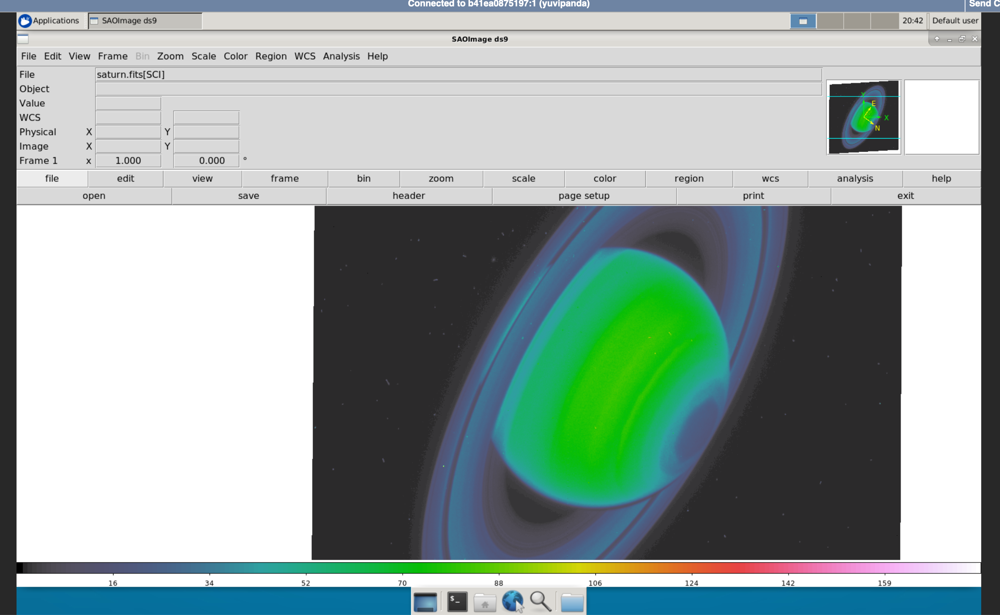

# ds9 Astro viewer on your browser

[SAOImage DS9](http://ds9.si.edu) is an astronomical imaging and data visualization application. It is a desktop
application, but widely used in the astronomy community.

This repository is a demo of using [jupyter-desktop](https://github.com/yuvipanda/jupyter-desktop)
to run ds9 in your browser with no installation. This can easily be run in your own institutional
JupyterHub as well.

## Credits

[Simon Li](https://github.com/manics/) and [Ryan Lovett](https://github.com/ryanlovett/)
did a lot of the jupyter-desktop work. [Jacob Matuskey](https://github.com/jmatuskey)
from the [Space Telescope Science Institute](http://stsci.edu/) did the integration work
to get ds9 running on it.